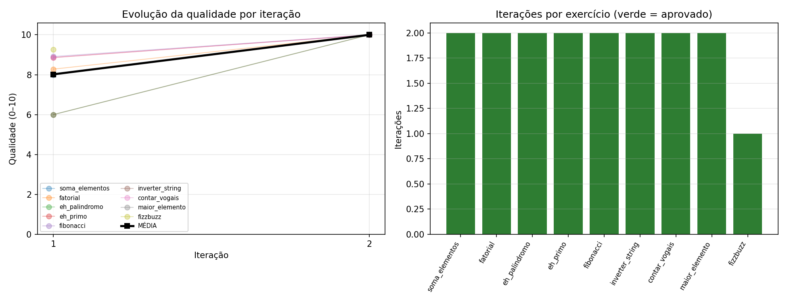

# Pipeline Multi-Agente Reflexivo para Qualidade de Código Python

> **Trabalho Final — Tópicos em Engenharia de Software · PUC-Campinas**
> **Grupo 6 (G6): Decomposição de tarefas e especialização por papéis** (padrão *critic/verifier*)

Pipeline multi-agente que aplica o **padrão reflexivo (Reflexion)** para elevar, de forma
**mensurável**, a qualidade de código Python gerado por um LLM. Um agente **Coder** escreve o
código; um agente **Critic** o avalia com ferramentas reais (**pylint**, **bandit**, **pytest**);
se reprovar, o código volta ao Coder para correção — num laço de **até 3 iterações**.
Tudo orquestrado com **LangGraph**.

## Pergunta de pesquisa
Um pipeline multi-agente com um Critic automático consegue corrigir erros, mitigar
vulnerabilidades e alinhar o código à PEP 8 de forma autônoma, em até 3 iterações por exercício?

## Arquitetura

```
         +---------------------------------------+
         v                                       |
   [ START ] --> ( CODER ) --> ( CRITIC ) --> aprovado?
                  gera /        pylint            |
                  corrige       bandit            +-- nao ----> volta ao CODER
                                pytest            |
                                                  +-- sim / 3 iteracoes --> [ FIM ]
```

- **Coder** ([graph.py](graph.py)) — gera o código ou o corrige com base no feedback do Critic.
- **Critic** ([graph.py](graph.py) + [ferramentas_critic.py](ferramentas_critic.py)) — executa
  pylint + bandit + pytest e calcula uma **nota de qualidade de 0 a 10**
  (corretude 50% + estilo 40% + segurança 10%).
- **Aresta condicional** — aprova e finaliza, ou devolve para corrigir, respeitando o teto de 3 iterações.

## Resultados

- **9 de 10 exercícios concluídos — todos aprovados.**
- Qualidade média subiu de **8,0 → 9,9** (escala 0–10).
- A avaliação é **real** (não simulada): é isso que torna o ganho de qualidade *mensurável*.



> Detalhe interessante: em um dos exercícios o código **regrediu** entre iterações (corrigiu o
> estilo mas quebrou a lógica), mostrando que o loop reflexivo nem sempre melhora de forma
> monotônica — uma limitação real do padrão.

## Demonstração (vídeo ≤ 2 min)

<!-- COMO EMBARCAR:
     MP4: abra um issue no repo, arraste o .mp4 para o comentário, copie a URL gerada e cole abaixo.
     GIF: salve como painel/demo.gif e use:   -->

_(cole aqui a URL do vídeo ou o GIF da demonstração — gerado com `python demo.py`)_

## Stack técnica

| Camada | Ferramenta |
|---|---|
| Orquestração | LangGraph |
| Modelo (LLM) | Gemini 2.5 Flash-Lite *(configurável; também suporta GPT-4o-mini)* |
| Estilo / PEP 8 | Pylint |
| Segurança | Bandit |
| Corretude | Pytest |
| Gráficos | Matplotlib |

## Estrutura do projeto

| Arquivo | Papel |
|---|---|
| [state.py](state.py) | Estado compartilhado do grafo (`AgentState`) |
| [graph.py](graph.py) | Grafo LangGraph: nós Coder e Critic + aresta condicional |
| [ferramentas_critic.py](ferramentas_critic.py) | Wrappers reais de pylint, bandit e pytest |
| [exercicios.py](exercicios.py) | Os 10 exercícios + casos de teste |
| [executar_experimento.py](executar_experimento.py) | Roda os 10 exercícios, salva resultados e gera o gráfico |
| [relatorio.py](relatorio.py) | Resumo no terminal + gráfico de evolução |
| [demo.py](demo.py) | Demonstração enxuta (ideal para o vídeo) |
| [main.py](main.py) | Demo rápida de 1 exercício |
| [smoke_test_offline.py](smoke_test_offline.py) | Valida o pipeline sem gastar API |

## Como instalar e executar

### 1. Pré-requisitos
Python 3.10+.

### 2. Ambiente virtual e dependências
```bash
python -m venv venv
# Windows (PowerShell):  .\venv\Scripts\Activate.ps1
# Linux/macOS:           source venv/bin/activate
pip install langgraph langchain-openai langchain-google-genai python-dotenv pylint bandit pytest matplotlib ipykernel
```

### 3. Chave da API
Crie um arquivo `.env` na raiz do projeto (**não comite — já está no `.gitignore`**):
```env
LLM_PROVIDER=gemini
GEMINI_MODEL=gemini-2.5-flash-lite
GOOGLE_API_KEY=sua_chave_aqui
```
> Chave gratuita em https://aistudio.google.com. Para usar OpenAI:
> `LLM_PROVIDER=openai` e `OPENAI_API_KEY=sua_chave`.

### 4. Executar
```bash
python executar_experimento.py   # experimento completo (10 exercícios) + gráfico
python demo.py                   # demonstração enxuta (1 exercício + resumo)
python smoke_test_offline.py     # valida o pipeline sem usar a API
```

> O experimento é **resiliente**: salva o progresso a cada exercício em `resultados.json`.
> Se a cota da API esgotar, basta rodar de novo — ele continua de onde parou.

## Referências
Lista completa em formato ABNT no arquivo **[referencias.md](referencias.md)**.

## Equipe e contribuições
- **David** (Tech Lead) — estrutura do grafo no LangGraph, arestas condicionais e gerência de estado.
- **Daniel** (Dev Coder) — engenharia de prompt do agente Coder, integração com a API do LLM e tratamento de saídas.
- **Rafael** (Dev Critic) — wrappers de execução local de pylint, bandit e pytest, estruturando o retorno em JSON.
- **Gabriel** (QA) — curadoria dos 10 exercícios e suíte de testes automatizados.
- **Murilo** (Design/Comunicação) — documentação técnica e organização dos dados.
